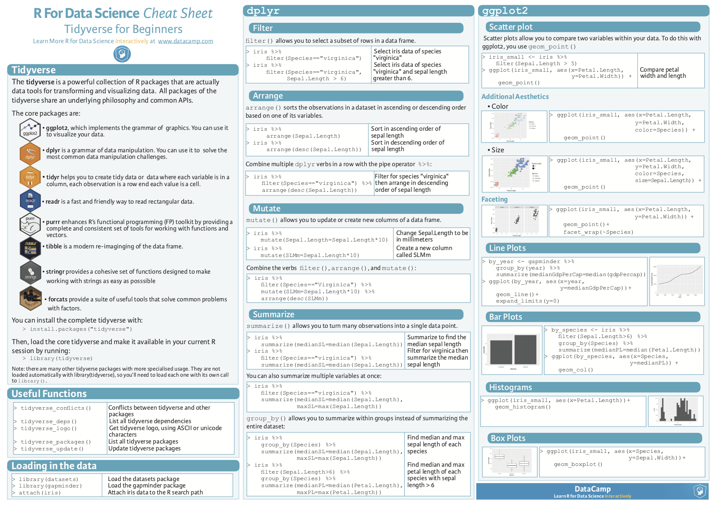
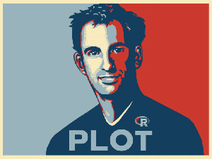
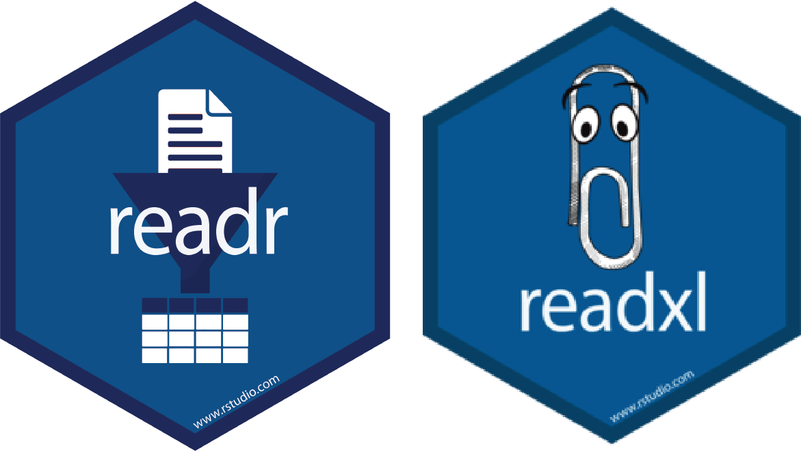

```{r setup, include=FALSE}
knitr::opts_chunk$set(echo = FALSE)
```

## CodeR TSV

### Our Joruney so far...

1. Intro to Rmarkdown (Ira)
2. Intro to Git/GitHub (Cesar)
3. Intro to the Tidyverse (Me)
4. How about a Recap/Hack Session? (Dec 9th)

### Our Resources
- GitHub Orgnaisation
- Slack Group
- Hex Stick!!
- What else do we want?


## Now Entering the Tidyverse

- What is the "tidyverse"
- How do you use it?
- Give it a go!

## Now Entering the Tidyverse
Website: https://www.tidyverse.org

### Cheat Sheet

{width=400px}

#### More Cheat sheets: 

- Rstudio -> Help -> Cheatsheets -> Browse Cheatsheets
- https://rstudio.com/resources/cheatsheets/

## What is the Tidyverse? {.build}

- An opionated list of useful packages
- __One package to rule them all!!__
- R packages for preparing, wrangling and visualizing data
- Often refered to as the "Hadleyverse"



## Load the tidyverse

```{r, echo = TRUE}

library(tidyverse)
```

## Load the tidyverse

```{r, echo = TRUE}
tidyverse_packages()
```

## Pipe (%>%) Operator {.build}

- The "%>%" is the "Pipe" operator
- Forward a value, or the result of an expression, into the next function call/expression

```{r cars, echo = TRUE}
cars %>% filter(speed >= 10)
```
## Pipe (%>%) Operator {.build}

- Reduces the  amoung of code you write
- More reable
- Can pipe directly into a plot

```{r, echo = TRUE, fig.height= 3}
cars %>% filter(speed >= 10) %>% 
  ggplot() + geom_point(aes(x = speed, y = dist))

```


## Reading Data

### readr

The goal of readr is to provide a fast and friendly way to read rectangular data (like csv, tsv, and fwf). It is designed to flexibly parse many types of data found in the wild, while still cleanly failing when data unexpectedly changes

### readxl

The readxl package makes it easy to get data out of Excel and into R.

{width=300px}

## readr {.smaller}

```{r, echo = TRUE}
read_csv(readr_example("mtcars.csv"))
```

## readxls {.smaller}

```{r, echo = TRUE}
library(readxl)
read_excel(readxl_example("datasets.xlsx"))
```


## The Tibble {.smaller}

### What is a "Tibble"{.smaller}
>A tibble, or tbl_df, is a modern reimagining of the data.frame, keeping what time has proven to be effective, and throwing out what is not. Tibbles are data.frames that are lazy and surly: they do less (i.e. they don’t change variable names or types, and don’t do partial matching) and complain more (e.g. when a variable does not exist). This forces you to confront problems earlier, typically leading to cleaner, more expressive code. Tibbles also have an enhanced print() method which makes them easier to use with large datasets containing complex objects.

## The Tibble {.smaller}

### What is a "Tibble"{.smaller}
```{r, echo = TRUE}
library(tibble)
as_tibble(iris)
```

## The Tibble {.smaller}

### Glimpse a tibble{.smaller}
```{r, echo = TRUE}
library(tibble)
as_tibble(iris) %>% glimpse()
```

## Wrangling Data {.smaller}

### filter()

Easily filter your data

```{r, echo = TRUE}
as_tibble(iris) %>% filter(Species == "setosa", Sepal.Length >= 5)

```


## Wrangling Data {.build}

### select() & rename()


## Wrangling Data {.build}

### group_by() & summarise()


## Wrangling Data {.build}

### mutate() & case_when()


## Tidyr: the long and the wide of it

### __Make Data Tidy Again__
The goal of tidyr is to help you create tidy data. 

Tidy data is data where:

- Every column is variable.
- Every row is an observation.
- Every cell is a single value.


